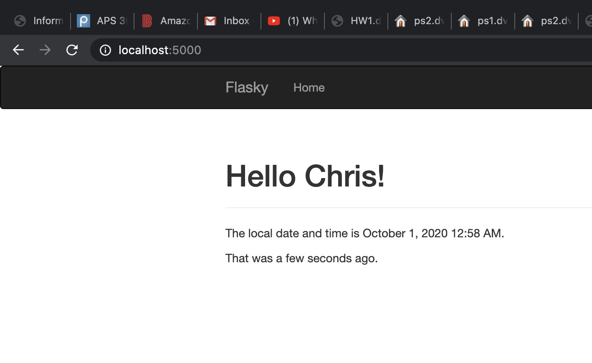
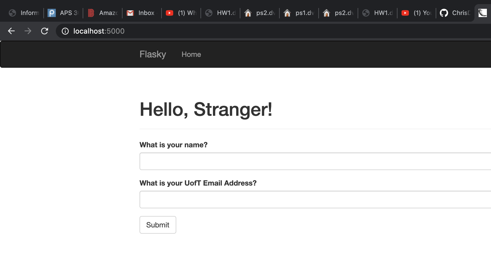
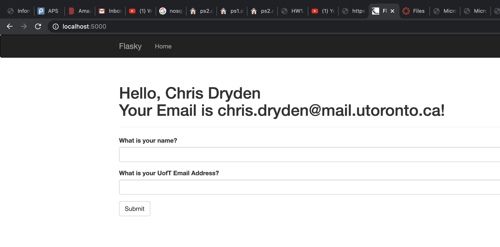
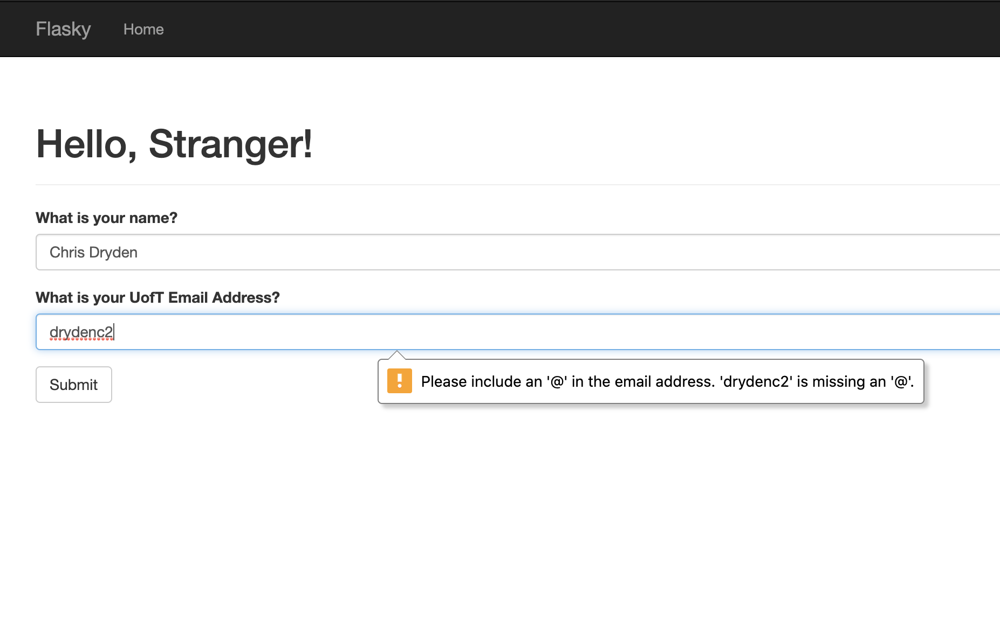
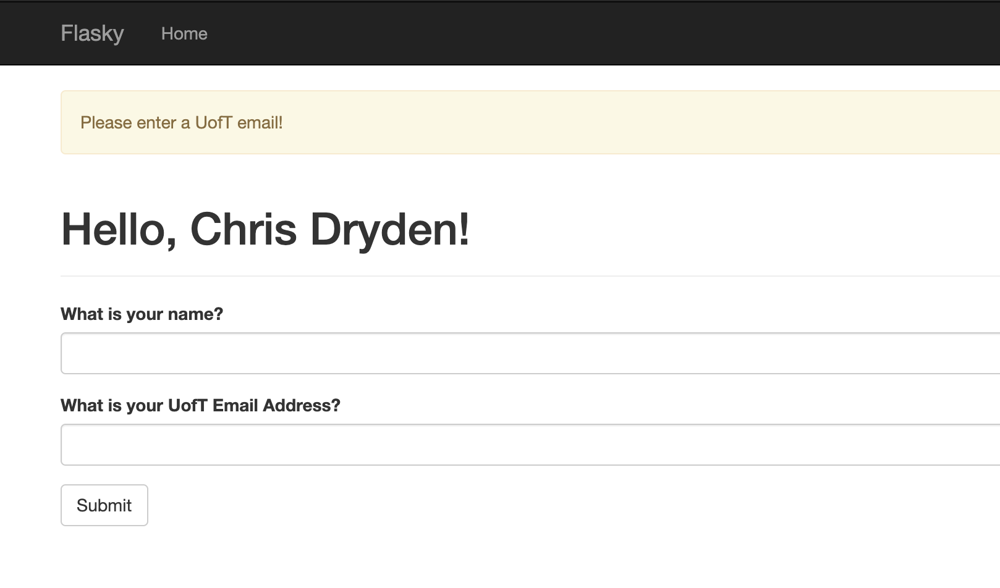

# ECE444-F2020-Lab3

Chris Dryden Lab 3

This repo is a clone of
https://github.com/miguelgrinberg/flasky

Activity 1: 
  
  

Activity 2:

Activity 3:
The main difference is that the sql database is a table based database with relations between different keys whereas nosql databases are key documents relational. A practical example of this is that you can query by a secondary index quicklier and perform more complex secondary queries on a sql database however it will require scanning the whole database to scan for an secondary index condition. Nosql is vertically scalable whereas the sql database is horizontally scalable.
