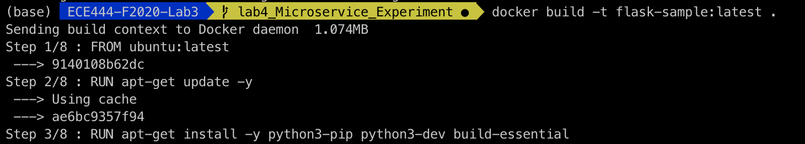
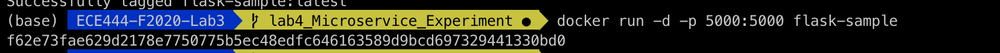
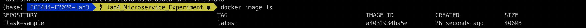
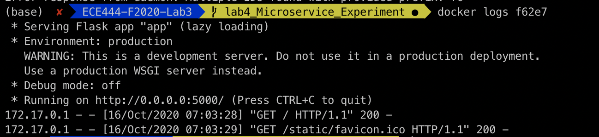

# ECE444-F2020-Lab3

Chris Dryden Lab 4

Explanation of how to start the system:
To start the docker container, you must first build the image using the command: docker build -t NAME   . Then you can run the docker container using the command: $ docker run -d -p 5000:5000 NAME    . The two ports that are listed in the command are the port that you are trying to connect to and the port that it will show up as on your own machine. The configuration of the docker container is in the file Dockerfile in the root of this project directory.

Screenshots:

Difference Between Virtual Machine and Docker:
Docker allows you to programmatically defined your operating system and it creates quickly downloadable images that can be used to create docker containers. Virtual machines are running a seperate operating system that is virtualized on your own system. Virtual machines are more used for running programs that require a specific os, and are often not not configured to run on demand whereas docker images are shareable and docker containers are spun up and down very often to run programs.
